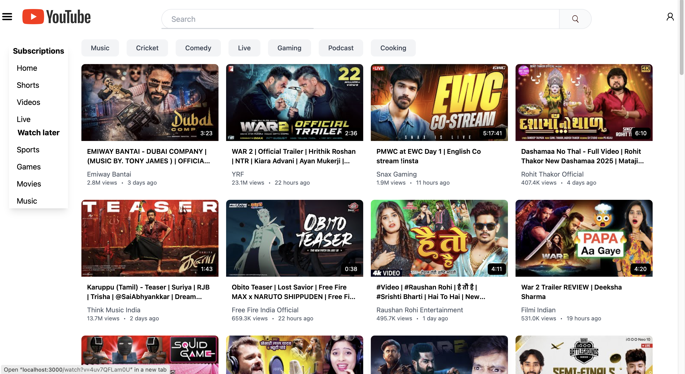
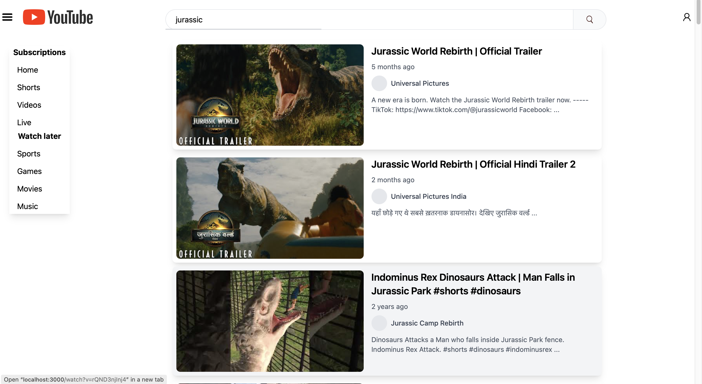

# YouTube Clone

A React-based YouTube clone featuring real-time search suggestions, live chat simulation, and video playback functionality.

## Screenshots


---

---

## Features

- 🎥 Video playback with YouTube player integration
- 🔍 Real-time search suggestions with debouncing (200ms)
- 💬 Simulated live chat with random message generation

## Getting Started

### Installation

1. Clone the repository

2. Install dependencies
```bash
npm install
```

3. Set up environment variables

Create a .env file in the root directory.
Get your YouTube Data API key:
1. Go to Google Cloud Console
2. Create a new project or select an existing one
3. Enable the YouTube Data API v3
4. Go to Credentials and create an API key
5. Copy the API key
6. Add your API key to the .env file:

```REACT_APP_GOOGLE_API_KEY=your_api_key_here```


4. Start the development server:

```bash
npm start
```